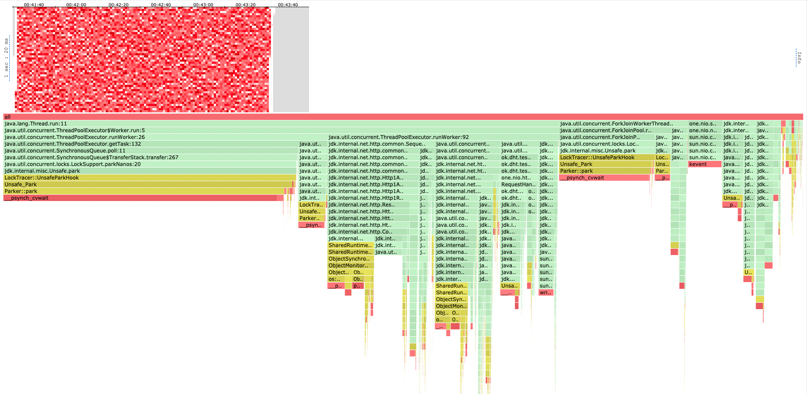
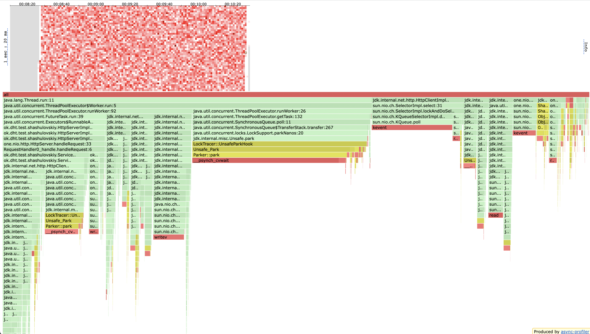
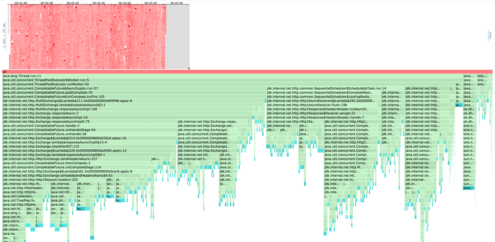
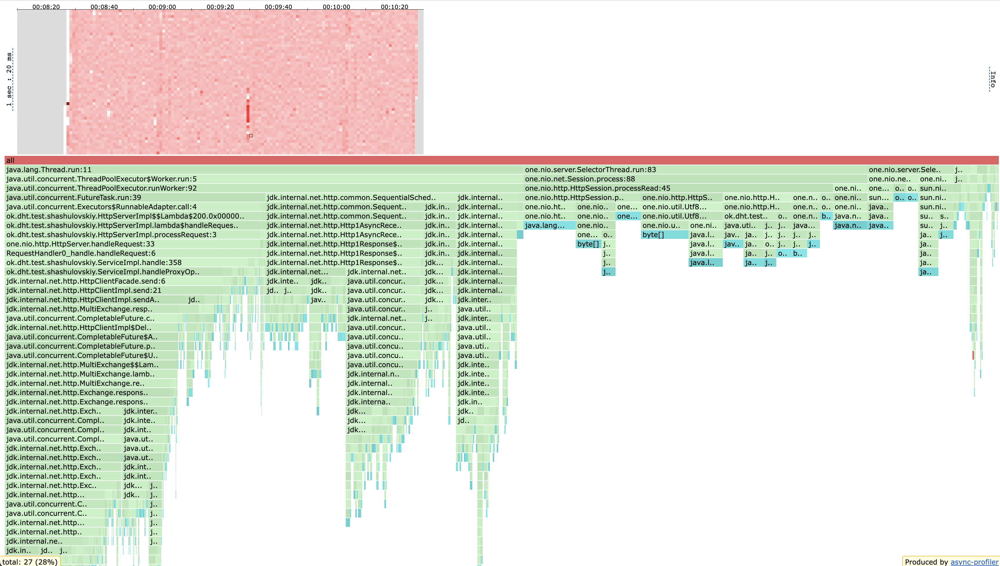
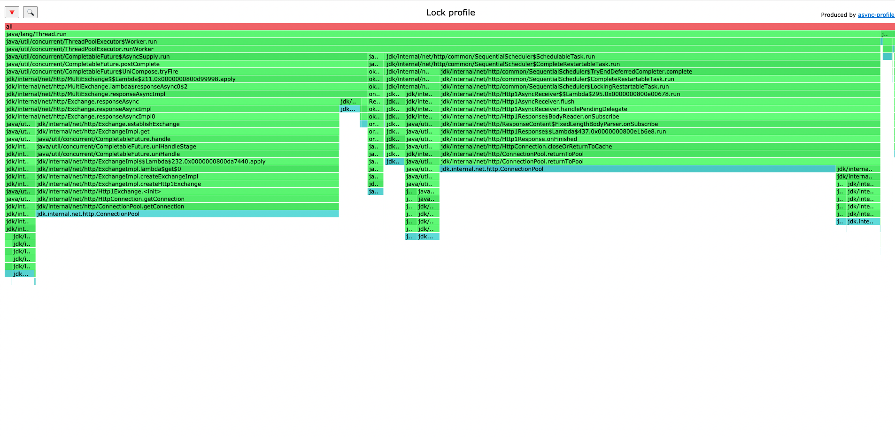
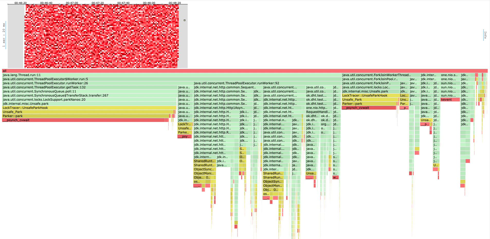
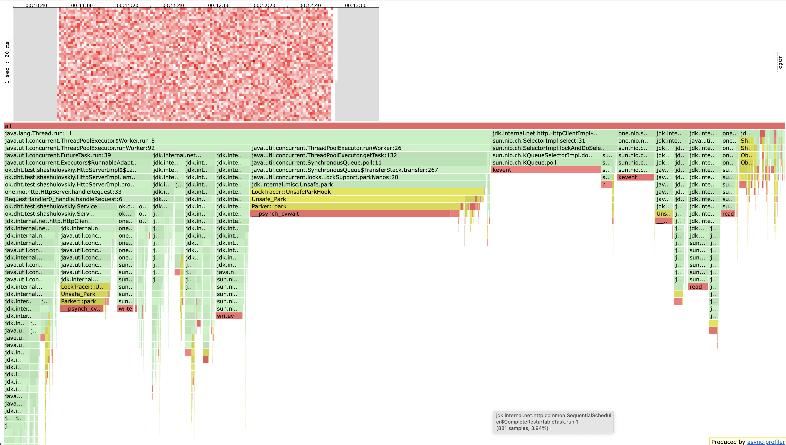

# Описание решения

Теперь вместо синхронной отправки запросов на реплики используется асинхронная. Чтобы координировать актуальный ответ
я разработал потокобезопасный класс ResponseAccumulator. После получения ответа на каждый из запросов будем в него сообщать
о том, что пришел успешный ответ.

Внутри поддерживаются два счетчика: кол-во успешных запросов и кол-во запросов обработанных в целом. Также я сразу поддерживаю
сразу самый актуальный ответ (с последним таймштампом), его я обновляю в CAS-loop'е. Некоторые мысли по поводу такой реализации
я отписал в выводах в конце отчета.

В итоге мы отправим один ответ. Либо когда получим ack успешных ответов, либо когда получим все (в т.ч неуспешные) ответы
от всех реплик. Тогда, (если мы еще не послали успешный ответ) отправим ошибку 504.

В качестве пула потоков для ожидания ответов на асинхронные запросы хорошо было бы оставить дефолтный ForkJoinPool,
т.к у нас в сервисе и так уже есть большой contention за системные ресурсы. В самом ожидании не происходит никакой работы,
поэтому создавать на это отдельный тред пул было бы дополнительным накладным расходом, который породил бы еще больший 
contention, а дефолтный ForkJoinPool является work-stealing pool'ом, реализован очень эффективно и все равно уже есть
по умолчанию. Однако мы совершенно не контролируем то, что в нем исполняется и можем наткнуться на ситуацию когда он 
весь забит какими-нибудь параллельными стримами (в будущем). Поэтому я решил просто создать для этих целей еще один
ForkJoinPool. Очень важно выполнять запросы либо в нем, либо в воркер треде (если переключать контекст дороже), главное
чтобы это произошло не в селекторе, так как тогда мы вернемся к проблеме, которую решали на втором этапе.

Все остальное в целом по коду осталось неизменным.

# Нагрузочное тестирование

Тестировать я буду с 3 шардами в кластере и c дефолтным кворумом (ack = 2/from = 3).
Для начала, в лучших традициях, наполним наши шарды данными, по гигабайту на каждый, чтобы тестировать работу не только в
оперативной памяти.

Сравнивать буду с решением из прошлого задания, чтобы понять, какой выигрыш нам дала асинхронная реализация.

## PUT

Тестировать будем как всегда уже проверенным скриптом
```
request = function()
url = '/v0/entity?id=key' .. math.random(1, m)
body = 'value' .. math.random(1, 1000)

    return wrk.format("PUT", url, {}, body)
end
```
m положим равным 100000.

Начнем, как всегда, с RPS в 30000, чтобы нащупать оптимальный

```
wrk2 -t 16 -c 64 -d 2m -R 30000 -L http://localhost:19234 -s load_testing_put.lua
Running 2m test @ http://localhost:19234
  16 threads and 64 connections
  Thread calibration: mean lat.: 3950.847ms, rate sampling interval: 12787ms
  Thread calibration: mean lat.: 3937.335ms, rate sampling interval: 12730ms
  Thread calibration: mean lat.: 3946.029ms, rate sampling interval: 12828ms
  Thread calibration: mean lat.: 3949.333ms, rate sampling interval: 12804ms
  Thread calibration: mean lat.: 3959.323ms, rate sampling interval: 12836ms
  Thread calibration: mean lat.: 3960.274ms, rate sampling interval: 12886ms
  Thread calibration: mean lat.: 3937.797ms, rate sampling interval: 12820ms
  Thread calibration: mean lat.: 3960.115ms, rate sampling interval: 12918ms
  Thread calibration: mean lat.: 3927.180ms, rate sampling interval: 12820ms
  Thread calibration: mean lat.: 3944.509ms, rate sampling interval: 12795ms
  Thread calibration: mean lat.: 3961.746ms, rate sampling interval: 12828ms
  Thread calibration: mean lat.: 3972.129ms, rate sampling interval: 12861ms
  Thread calibration: mean lat.: 3975.827ms, rate sampling interval: 12935ms
  Thread calibration: mean lat.: 3904.193ms, rate sampling interval: 12730ms
  Thread calibration: mean lat.: 3950.016ms, rate sampling interval: 12836ms
  Thread calibration: mean lat.: 3971.249ms, rate sampling interval: 12877ms
  Thread Stats   Avg      Stdev     Max   +/- Stdev
    Latency    42.05s    21.13s    1.31m    56.90%
    Req/Sec   656.26     37.83   715.00     75.00%
  Latency Distribution (HdrHistogram - Recorded Latency)
 50.000%   42.60s 
 75.000%    1.01m 
 90.000%    1.19m 
 99.000%    1.29m 
 99.900%    1.31m 
 99.990%    1.31m 
 99.999%    1.31m 
100.000%    1.31m 

  Detailed Percentile spectrum:
       Value   Percentile   TotalCount 1/(1-Percentile)

    6844.415     0.000000            2         1.00
...
   78708.735     1.000000      1155362          inf
#[Mean    =    42047.306, StdDeviation   =    21129.818]
#[Max     =    78643.200, Total count    =      1155362]
#[Buckets =           27, SubBuckets     =         2048]
----------------------------------------------------------
  1247129 requests in 2.00m, 79.69MB read
Requests/sec:  10392.34
Transfer/sec:    679.97KB
```

Получили ожидаемый захлеб, попробуем меньше.

```
wrk2 -t 16 -c 64 -d 2m -R 10500 -L http://localhost:19234 -s load_testing_put.lua
Running 2m test @ http://localhost:19234
  16 threads and 64 connections
  Thread calibration: mean lat.: 238.220ms, rate sampling interval: 712ms
  Thread calibration: mean lat.: 208.550ms, rate sampling interval: 632ms
  Thread calibration: mean lat.: 251.078ms, rate sampling interval: 674ms
  Thread calibration: mean lat.: 205.160ms, rate sampling interval: 647ms
  Thread calibration: mean lat.: 217.224ms, rate sampling interval: 660ms
  Thread calibration: mean lat.: 263.026ms, rate sampling interval: 791ms
  Thread calibration: mean lat.: 230.888ms, rate sampling interval: 732ms
  Thread calibration: mean lat.: 233.001ms, rate sampling interval: 696ms
  Thread calibration: mean lat.: 218.329ms, rate sampling interval: 712ms
  Thread calibration: mean lat.: 254.495ms, rate sampling interval: 742ms
  Thread calibration: mean lat.: 224.807ms, rate sampling interval: 742ms
  Thread calibration: mean lat.: 232.198ms, rate sampling interval: 681ms
  Thread calibration: mean lat.: 202.209ms, rate sampling interval: 603ms
  Thread calibration: mean lat.: 229.801ms, rate sampling interval: 706ms
  Thread calibration: mean lat.: 239.249ms, rate sampling interval: 726ms
  Thread calibration: mean lat.: 222.591ms, rate sampling interval: 662ms
  Thread Stats   Avg      Stdev     Max   +/- Stdev
    Latency   102.94ms  109.86ms 589.82ms   82.44%
    Req/Sec   656.29     27.10   724.00     77.68%
  Latency Distribution (HdrHistogram - Recorded Latency)
 50.000%   52.41ms
 75.000%  177.79ms
 90.000%  260.61ms
 99.000%  431.87ms
 99.900%  545.28ms
 99.990%  579.58ms
 99.999%  587.77ms
100.000%  590.34ms

  Detailed Percentile spectrum:
       Value   Percentile   TotalCount 1/(1-Percentile)

       0.239     0.000000            1         1.00
...
     590.335     0.999999      1154622   1165084.44
     590.335     1.000000      1154622          inf
#[Mean    =      102.936, StdDeviation   =      109.864]
#[Max     =      589.824, Total count    =      1154622]
#[Buckets =           27, SubBuckets     =         2048]
----------------------------------------------------------
  1259335 requests in 2.00m, 80.47MB read
Requests/sec:  10494.19
Transfer/sec:    686.63KB
```

Мы выдерживаем RPS в примерно 10500, видим распределение latency без аномалий. Сравним с синхронной реализацией:

```
wrk2 -t 16 -c 64 -d 2m -R 10500 -L http://localhost:19234 -s load_testing_put.lua
Running 2m test @ http://localhost:19234
  16 threads and 64 connections
  Thread calibration: mean lat.: 56.693ms, rate sampling interval: 334ms
  Thread calibration: mean lat.: 99.035ms, rate sampling interval: 581ms
  Thread calibration: mean lat.: 326.775ms, rate sampling interval: 2547ms
  Thread calibration: mean lat.: 161.475ms, rate sampling interval: 1262ms
  Thread calibration: mean lat.: 232.778ms, rate sampling interval: 1417ms
  Thread calibration: mean lat.: 88.062ms, rate sampling interval: 487ms
  Thread calibration: mean lat.: 196.342ms, rate sampling interval: 1409ms
  Thread calibration: mean lat.: 323.327ms, rate sampling interval: 3110ms
  Thread calibration: mean lat.: 696.209ms, rate sampling interval: 4902ms
  Thread calibration: mean lat.: 113.648ms, rate sampling interval: 518ms
  Thread calibration: mean lat.: 337.208ms, rate sampling interval: 2465ms
  Thread calibration: mean lat.: 562.399ms, rate sampling interval: 5378ms
  Thread calibration: mean lat.: 429.620ms, rate sampling interval: 2639ms
  Thread calibration: mean lat.: 592.262ms, rate sampling interval: 5812ms
  Thread calibration: mean lat.: 997.213ms, rate sampling interval: 8765ms
  Thread calibration: mean lat.: 96.072ms, rate sampling interval: 610ms
  Thread Stats   Avg      Stdev     Max   +/- Stdev
    Latency     2.84s    10.58s    1.81m    94.31%
    Req/Sec   564.67    442.50     4.48k    89.27%
  Latency Distribution (HdrHistogram - Recorded Latency)
 50.000%    2.73ms
 75.000%  333.06ms
 90.000%    5.48s 
 99.000%    0.98m 
 99.900%    1.71m 
 99.990%    1.80m 
 99.999%    1.81m 
100.000%    1.81m 

  Detailed Percentile spectrum:
       Value   Percentile   TotalCount 1/(1-Percentile)

       0.089     0.000000            1         1.00
...
       0.733     0.100000       101065         1.11  108527.615     0.999986      1008589     72817.78
  108527.615     1.000000      1008589          inf
#[Mean    =     2837.908, StdDeviation   =    10580.932]
#[Max     =   108462.080, Total count    =      1008589]
#[Buckets =           27, SubBuckets     =         2048]
----------------------------------------------------------
  1083644 requests in 2.00m, 69.24MB read
  Socket errors: connect 0, read 0, write 0, timeout 898
Requests/sec:   9030.50
Transfer/sec:    590.86KB
```

На тех же самых 10500 RPS видим сильный захлеб, latency на высоких персентилях улетает в две минуты. Из прошлого отчета
мы знаем, что там мы держали примерно 8000 RPS. То есть прирост примерно 31 процент по latency

## GET

Начнем, как всегда, с RPS в 30000, чтобы нащупать оптимальный

```
wrk2 -t 16 -c 64 -d 2m -R 30000 -L http://localhost:19234 -s load_testing_get.lua
Running 2m test @ http://localhost:19234
  16 threads and 64 connections
  Thread calibration: mean lat.: 3591.392ms, rate sampling interval: 11894ms
  Thread calibration: mean lat.: 3606.481ms, rate sampling interval: 11935ms
  Thread calibration: mean lat.: 3594.532ms, rate sampling interval: 11894ms
  Thread calibration: mean lat.: 3581.657ms, rate sampling interval: 11886ms
  Thread calibration: mean lat.: 3587.373ms, rate sampling interval: 11870ms
  Thread calibration: mean lat.: 3623.061ms, rate sampling interval: 11993ms
  Thread calibration: mean lat.: 3591.663ms, rate sampling interval: 11894ms
  Thread calibration: mean lat.: 3608.489ms, rate sampling interval: 11968ms
  Thread calibration: mean lat.: 3586.008ms, rate sampling interval: 11878ms
  Thread calibration: mean lat.: 3594.265ms, rate sampling interval: 11911ms
  Thread calibration: mean lat.: 3593.293ms, rate sampling interval: 11927ms
  Thread calibration: mean lat.: 3578.464ms, rate sampling interval: 11853ms
  Thread calibration: mean lat.: 3597.353ms, rate sampling interval: 11919ms
  Thread calibration: mean lat.: 3600.143ms, rate sampling interval: 11943ms
  Thread calibration: mean lat.: 3593.133ms, rate sampling interval: 11911ms
  Thread calibration: mean lat.: 3572.935ms, rate sampling interval: 11853ms
  Thread Stats   Avg      Stdev     Max   +/- Stdev
    Latency    41.47s    20.28s    1.28m    57.55%
    Req/Sec   678.39     12.33   696.00     69.44%
  Latency Distribution (HdrHistogram - Recorded Latency)
 50.000%   41.78s 
 75.000%    0.99m 
 90.000%    1.16m 
 99.000%    1.27m 
 99.900%    1.28m 
 99.990%    1.28m 
 99.999%    1.28m 
100.000%    1.28m 

  Detailed Percentile spectrum:
       Value   Percentile   TotalCount 1/(1-Percentile)

    6496.255     0.000000            1         1.00
...
   77070.335     1.000000      1194203          inf
#[Mean    =    41474.919, StdDeviation   =    20282.990]
#[Max     =    77004.800, Total count    =      1194203]
#[Buckets =           27, SubBuckets     =         2048]
----------------------------------------------------------
  1295903 requests in 2.00m, 86.12MB read
  Non-2xx or 3xx responses: 294774
Requests/sec:  10796.29
Transfer/sec:    734.73KB
```

Получили ожидаемый захлеб, попробуем меньше.

```
wrk2 -t 16 -c 64 -d 2m -R 9800 -L http://localhost:19234 -s load_testing_get.lua
Running 2m test @ http://localhost:19234
  16 threads and 64 connections
  Thread calibration: mean lat.: 278.856ms, rate sampling interval: 892ms
  Thread calibration: mean lat.: 282.587ms, rate sampling interval: 900ms
  Thread calibration: mean lat.: 295.486ms, rate sampling interval: 879ms
  Thread calibration: mean lat.: 312.832ms, rate sampling interval: 876ms
  Thread calibration: mean lat.: 295.012ms, rate sampling interval: 903ms
  Thread calibration: mean lat.: 283.930ms, rate sampling interval: 885ms
  Thread calibration: mean lat.: 351.109ms, rate sampling interval: 967ms
  Thread calibration: mean lat.: 272.823ms, rate sampling interval: 879ms
  Thread calibration: mean lat.: 257.447ms, rate sampling interval: 826ms
  Thread calibration: mean lat.: 277.945ms, rate sampling interval: 902ms
  Thread calibration: mean lat.: 318.378ms, rate sampling interval: 958ms
  Thread calibration: mean lat.: 244.875ms, rate sampling interval: 794ms
  Thread calibration: mean lat.: 314.189ms, rate sampling interval: 956ms
  Thread calibration: mean lat.: 282.425ms, rate sampling interval: 932ms
  Thread calibration: mean lat.: 303.163ms, rate sampling interval: 927ms
  Thread calibration: mean lat.: 265.060ms, rate sampling interval: 851ms
  Thread Stats   Avg      Stdev     Max   +/- Stdev
    Latency    77.15ms  153.70ms 889.34ms   86.74%
    Req/Sec   612.53     28.30   751.00     83.14%
  Latency Distribution (HdrHistogram - Recorded Latency)
 50.000%    6.90ms
 75.000%   43.39ms
 90.000%  298.24ms
 99.000%  678.91ms
 99.900%  775.17ms
 99.990%  859.13ms
 99.999%  885.76ms
100.000%  889.86ms

  Detailed Percentile spectrum:
       Value   Percentile   TotalCount 1/(1-Percentile)

       0.199     0.000000            1         1.00
...
     889.855     1.000000      1078085          inf
#[Mean    =       77.148, StdDeviation   =      153.703]
#[Max     =      889.344, Total count    =      1078085]
#[Buckets =           27, SubBuckets     =         2048]
----------------------------------------------------------
  1175835 requests in 2.00m, 78.15MB read
  Non-2xx or 3xx responses: 267083
Requests/sec:   9798.86
Transfer/sec:    666.86KB
```

Тут уже мы держим меньший RPS в 9800. Это связано с тем, что GET сам по себе работает дольше,
плюс есть дополнительная, хоть и не очень большая, нагрузка на агрегацию ответов.
Однако, по прошлому отчету мы знаем, что синхронная реализация держала 11000, что больше чем наша
асинхронная. Напомню, что это вызвано оптимизацией которую я там написал: после получения ответов
от ack шардов я не посылал запросы на остальные, что, на нашей конфигурации, по сути уменьшало нагрузку
на шарды в полтора раза. Здесь такую оптимизацию провернуть не так тривиально, об этом я написал в выводах в
конце отчета.

# Профилирование с помощью async-profiler

## PUT

### CPU
#### Асинхронная реализация

#### Синхронная реализация


По CPU мы видим что профиль поменялся в основном в методах HttpClient'а что логично, ведь мы теперь отправляем
запросы асинхронно, а не синхронно. 

Сразу бросается в глаза ожидания на мониторах которых раньше не было, это получение
и возвращение connection'ов в кешированый пул. Я поизучал код, и, как я понял, HttpClient переиспользует некоторые 
connection'ы из пула чтобы каждый раз их не пересоздавать, и в этом пуле он использует synchronized чтобы туда 
класть/забирать.

Опять же на профиле очень много park'ов. Это связано с тем, что у нас используется сильно больше потоков чем ядер в системе,
например уже селекторов используется по кол-ву ядер, а также в каждом моем шарде для пула воркеров из ДЗ2. В связи с этим
часто переключается контекст.

Других аномалий я не вижу.

### ALLOC
#### Асинхронная реализация

#### Синхронная реализация


Тут бросается в глаза то, что раньше аллокации селектора занимали 34 процента от общего числа, то теперь это
всего-лишь 2 процента. Это вызвано тем, что сервис хуже справлялся c нагрузкой и селекоторы успели населектить 
запросов больше чем было обработано. В остальном, если смотреть на остальную часть профиля, она такая же,
как и раньше.

Основным спонсором аллокаций стали CompletableFuture и доп расходы на асинхронную обработку

### LOCK
#### Асинхронная реализация

#### Синхронная реализация


Тут профиль лок тоже немного поменялся. Асинхронная обработка реализована на пуле потоков, поэтому тут появились новые 
блокировки, в т.ч на пул соединений про который я писал в секции про CPU.

Код который я писал для ResponseAccumulator lock-free и в связи с этим понятно не светится на этом профиле.

## GET

### CPU
#### Асинхронная реализация

#### Синхронная реализация


Здесь профиль такой же как при PUT'е, однако видно больше работы на самой операции чтения из базы, так как в отличие от
PUT'а мы там не только ходим в оперативную память, но и бегаем по файликам, ищем наше значение.

### ALLOC
#### Асинхронная реализация

#### Синхронная реализация


Здесь тоже профиль практически идентичный PUT'у

### LOCK
#### Асинхронная реализация

#### Синхронная реализация


По сравнению с PUT'ом разница лишь в появлении блокировки в tryAsyncReceive на BodyReader'е. В целом оно и логично,
тело ответа надо получать, а в PUT'е тела ответа не было.

# Выводи и идеи по оптимизации
1. Получили выигрыш на 30% по RPS в случае PUT запросов. На GET запросах немного проиграли, но это можно решить
тем, что я описал в пункте 3.
2. Сейчас агрегация запросов для GET'а написана lock-free образом на CAS'ах. Если у нас будет много ответов,
которые придут в одно время, то в этих cas-loop'ах начнется contention. Чтобы этого избежать можно попробовать реализацию
с thread-safe массивом, в который воркеры будут складывать полученные запросы, а потом какой-то из них, получивший 
последний необходимый успешный ответ сам агрегирует ответы. Чтобы понять какой из этих способов лучше надо провести 
тесты на реальной сети с большим кол-вом шардов, потому что мои локальные тесты не показали статистически значимой
разницы.
3. Для GET запросов аналогично мой реализации из прошлой ДЗ нам достаточно запросов на ack шардов чтобы операция считалась
завершенной, а мы шлем практически в два раза больше. Можно замерить время за которое отвечает условно 99 персентиль на
нашем проде и условно делать следующее:
- Сначала отправляем GET запросы на ack шардов
- Не получив ответы за время 99 персентиля отправить остальные запросы (таймаут у нас сильно больше)
- Наш мини circuit breaker может помнить: лежит ли сейчас какой-то шард, и если лежит, то сразу посылать запросы
на все шарды
Это позволит сильно снизить нагрузку на наши шарды в общем и ускорить ответ на GET запросы.
4. Раз уж мы отсылаем одинаковые запросы на все шарды, можно попробовать слать их ip мультикастом. Но мне не совсем очевидно
даст ли это прирост в производительности
5. Все еще актуальна оптимизация по переходу с HTTP на RPC протокол с меньшим оверхедом
6. Сейчас у нас по сути шарды для репликации выбираются случайно, но мы можем хотеть, например, чтобы шарды были как можно 
ближе друг к другу (в одном ДЦ) чтобы ускорить ответ, или наоборот как можно дальше (в разных ДЦ), чтобы например технические
работы не портили нам доступность. Это тоже можно реализовать как эвристику и задавать в конфигурации сервиса.